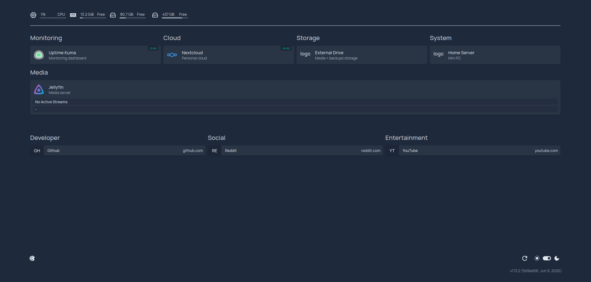

# Linux Homelab

A self-hosted Linux homelab designed to explore Linux administration, Docker, storage architecture, networking, and infrastructure engineering.

## Table of Contents

- [Overview](#overview)
- [System Architecture](#system-architecture)
- [Technology Stack](#technology-stack)
- [Objectives](#objectives)
- [Features](#features)
- [Design Decisions](#design-decisions)
- [Challenges and Solutions](#challenges-and-solutions)
- [Skills Demonstrated](#skills-demonstrated)
- [Lessons Learned](#lessons-learned)
- [Future Improvements](#future-improvements)

## Overview

A self-hosted Linux server built to explore modern infrastructure, system administration, and containerized application deployment.

This project documents the design, deployment, and maintenance of a homelab running on an HP EliteDesk 800 G6 Mini PC with Ubuntu Server and Docker Compose. The server hosts several services, including personal cloud storage, media streaming, service monitoring, and a centralized dashboard.

The project focuses on designing a maintainable system using persistent storage, containerized services, secure remote access, and documented infrastructure. Challenges involving Linux filesystems, Docker networking, and data persistence were solved to create a reliable self-hosted environment.

The repository serves as both documentation for the homelab and a portfolio demonstrating practical experience with Linux, Docker, storage architecture, networking, and infrastructure design.

## What This Server Provides

This homelab currently provides:

- Personal media streaming through Jellyfin
- Private cloud storage using Nextcloud
- Service monitoring with Uptime Kuma
- Centralized service dashboard with Homepage
- Secure remote access using Tailscale

## System Architecture

    

## Dashboard

Homepage provides a centralized dashboard for managing and accessing every self-hosted service from a single interface.

    

## Technology Stack

| Category         | Technologies                                       |
| ---------------- | -------------------------------------------------- |
| Operating System | Ubuntu Server 26.04 LTS                            |
| Hardware         | HP EliteDesk 800 G6 Mini PC                        |
| Containerization | Docker, Docker Compose                             |
| Applications     | Nextcloud, Jellyfin, Homepage, Uptime Kuma         |
| Database         | MariaDB                                            |
| Remote Access    | Tailscale                                          |
| Storage          | NVMe SSD, External NTFS HDD, ext4 filesystem image |
| Monitoring       | Uptime Kuma                                        |
| Version Control  | Git, GitHub      

## Objectives

This homelab was built to develop practical experience with technologies commonly used in software engineering and infrastructure roles as well as to serve as an environment for learning and experimentation.

- Gain hands-on experience administering a Linux server
- Practice containerized application deployment using Docker and Docker Compose
- Design a self-hosted infrastructure composed of independent services
- Explore storage strategies and filesystem management
- Implement secure remote access without exposing services directly to the public Internet
- Develop experience troubleshooting deployment, networking, and permission issues
- Practice documenting infrastructure in a way that reflects professional engineering standards

The homelab continues to evolve as new services and automation capabilities are added.

## Features

The homelab consists of several independent services, each deployed as its own Docker Compose project.

### Homepage

Provides a centralized dashboard for accessing and monitoring all self-hosted services from a single interface.

### Jellyfin

Self-hosted media server for streaming movies, television shows, and other personal media stored on the external drive.

### Nextcloud

Private cloud storage platform for file synchronization and management. Data is stored on a dedicated ext4 filesystem mounted from an image file to provide Linux-compatible permissions while utilizing external NTFS storage.

### MariaDB

Database backend supporting the Nextcloud application and managing persistent application metadata.

### Uptime Kuma

Monitors service availability and provides health checks for the homelab environment.

### Docker Compose

Each service is deployed as an independent Docker Compose project, simplifying maintenance, updates, and troubleshooting.

## Design Decisions

### Containerized Services

Each application is deployed as an independent Docker Compose project rather than combining all services into a single Compose file. This approach isolates failures, simplifies maintenance, and allows each service to be updated, restarted, or modified independently.

### Persistent Data

Application data is stored outside of containers using bind mounts and Docker volumes. This ensures configuration, databases, and media remain intact when containers are recreated or updated.

### Storage Architecture

The server uses a two-tier storage strategy. The operating system and Docker runtime reside on the internal NVMe SSD for responsiveness, while media and application data are stored on a 2 TB external hard drive.

Nextcloud data is stored on an ext4 filesystem contained within an image file on the NTFS-formatted external drive. This provides native Linux filesystem permissions while allowing the external drive to remain compatible with other systems when needed.

### Secure Remote Access

Remote administration is provided through Tailscale instead of exposing services directly to the public Internet. This reduces the attack surface while allowing secure access from trusted devices.

### Service Monitoring

Uptime Kuma continuously monitors the availability of self-hosted services, allowing issues to be detected quickly and verifying that services remain operational after configuration changes or updates.

### Centralized Dashboard

Homepage provides a single interface for accessing all hosted services. This improves usability and reduces the need to remember individual service URLs and ports.

## Challenges and Solutions

### Challenge: Filesystem Compatibility

**Problem**

Nextcloud requires a Linux filesystem with support for POSIX permissions. The available external storage was formatted as NTFS, which does not provide the permission model expected by Nextcloud.

**Solution**

An ext4 filesystem was created inside a disk image stored on the external drive. The image is mounted during system startup and used as Nextcloud's data directory, providing Linux-compatible permissions while preserving the existing NTFS storage layout.

---

### Challenge: Persistent Container Data

**Problem**

Containers are designed to be ephemeral, meaning application data can be lost if it remains inside the container filesystem.

**Solution**

Persistent bind mounts and Docker volumes were configured for application data, databases, configuration files, and media libraries so containers can be recreated without data loss.

---

### Challenge: Service Organization

**Problem**

Managing multiple self-hosted services can become difficult as the environment grows.

**Solution**

Each application was organized into its own Docker Compose project with dedicated configuration directories, making updates, troubleshooting, and future expansion easier to manage.

## Skills Demonstrated

**Linux & System Administration**
- Linux administration
- Filesystem management
- Service management

**Containerization**
- Docker
- Docker Compose
- Container lifecycle management

**Infrastructure**
- Networking
- Persistent storage
- Monitoring
- Remote access

**Databases**
- MariaDB

**Professional Practices**
- Documentation
- Troubleshooting

## Lessons Learned

## Future Improvements

- Automated backups

- Reverse proxy with HTTPS

- CI/CD deployment

- Infrastructure as Code

- Centralized logging

- Automated monitoring alerts

- Authentication improvements

- High availability experimentation

## Documentation

Additional technical documentation is organized by topic within the docs/ directory.

| Document | Description |
|----------|-------------|
| Architecture | System architecture and design decisions |
| Services | Configuration and deployment details |
| Storage | Storage layout and filesystem design |
| Networking | Docker networking and remote access |
| Troubleshooting | Common issues encountered and their solutions |
